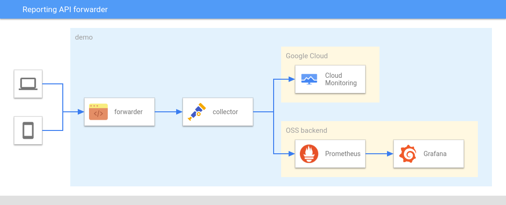
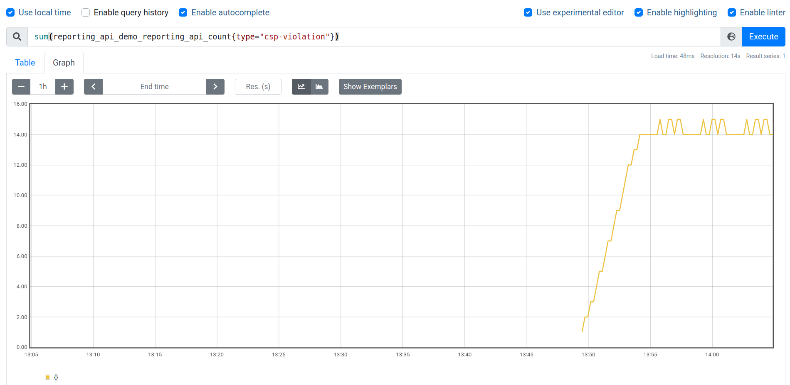

# Reporting API forwarder

This is an unoffical Google project to demonstrate the [Reporting API](https://www.w3.org/TR/reporting/)'s endpoint server.
This server works as a web server that receives all data from Reporting API and forwards them to monitoring tools such as [Google Cloud Monitoring](https://cloud.google.com/monitoring).
Also, for local testing purpose, you can try [Prometheus](https://prometheus.io/) with some additional configurations.


## Components

This repository contains the following subdirectories:

* `forwarder`: the main component that receives reports and forwards them to OpenTelemetry Collector
* `collector`: the config file for OpenTelemetry Collector
* `prometheus`: (optional) the config file for Prometheus

To confirm the details of each subdirectories, please find and read `README` files for detailed instructions.

The interaction of each components is described as below:


## How to try this sample

### Prerequisites

* [Docker Engine](https://docs.docker.com/engine/install/)
  * If you run the forwarder in Docker or to run `docker compose`

* [Docker Compose](https://docs.docker.com/compose/install/)
  * For the cases "with Cloud Monitorig" and "with Prometheus"

* Google Cloud project
  * For the case "with Cloud Monitoring"
### With Cloud Monitoring

#### Prepare Google Cloud project

In order to run this sample, you need to set up a Google Cloud project.

First, you need to create default credentials. Run the following commands for this demo.

```console
gcloud auth application-default login
chmod a+r ~/.config/gcloud/application_default_credentials.json
```
> **Note:** The instruction to change file permission of the credntial is just for this demonstration purpose, so after running this demo, please overwrite the permission as it was.
>
> ```console
> chmod go-r ~/.config/gcloud/application_default_credentials.json
> ```

Then you need a project where you send the reports to.

```console
gcloud projects create reporting-api-demo
```

Once the command is successfully done, enable "Cloud Monitoring API" in the project.

```console
gcloud services eanble monitoring
```

#### Prepare forwarder

After setting up Google Cloud project and credentials, you need to run the fowarder (reporting API endpoint).
Specify TLS certification files with the environment variables `CERT_FILE` and `KEY_FILE`. The default value is set to `cert/cert.pem` and `cert/key.pem`.

Then you need to add TLS certification files to `forwarder/cert` directory. Add cert file and key file there with the name `cert.pem` and `key.pem`.

After setting up [Docker Compose](https://docs.docker.com/compose/) (detailed in [README](./collector/README.md)), launch the Reporting API endpoint system with the following command:

```console
$ PROJECT_ID=$(gcloud config get-value project) docker-compose up
```

Then you will see the logs like the followings:

```console
 docker-compose up
WARNING: Found orphan containers (reporting-api-forwarder_prometheus_1, reporting-api-forwarder_reporter_1) for this project. If you removed or renamed this service in your compose file, you can run this command with the --remove-orphans flag to clean it up.
Starting reporting-api-forwarder_collector_1 ... done
Starting reporting-api-forwarder_forwarder_1 ... done
Attaching to reporting-api-forwarder_forwarder_1, reporting-api-forwarder_collector_1
forwarder_1  | {"severity":"INFO","timestamp":"2021-09-28T07:36:23.080139909Z","message":"Starting Reporting API forwarder: version 0.1.0.dev"}
forwarder_1  | ⇨ https server started on [::]:30443
collector_1  | 2021-09-28T07:36:23.473Z info    service/collector.go:303        Starting otelcontribcol...      {"Version": "v0.34.0", "NumCPU": 12}
collector_1  | 2021-09-28T07:36:23.474Z info    service/collector.go:242        Loading configuration...
...(omit)...
collector_1  | 2021-09-28T07:36:23.480Z info    service/collector.go:218        Everything is ready. Begin running and processing data.
```

As you can confirm in `docker-compose.yaml`, this demo uses the following ports:

|Port in localhost|Service using the port|Port in services|Purpose|
|-----------------|----------------------|----------------|-------|
|30443|forwarder|30443|HTTPS server endpoint|
|4317|collector|4317|OTLP gRPC endpoint|
|4318|collector|4318|OTLP HTTP endpoint|
|9990|collector|9990|Prometheus exporter endpoint|
|8888|collector|8888|Colletor's metrics exporting endpoint|
|9090|prometheus|9090|Prometheus UI's endpoint|

#### Remix glitch samples

After creating [Glitch](https://glitch.com) account, remix the following two projects.

1. https://glitch.com/edit/#!/reporting-api-demo
2. https://glitch.com/edit/#!/intervention-generator

`reporting-api-demo` is the report generator, and `intervention-generator` is the source to generate intervention error that is called via the iframe DOM in the `reporting-api-demo`.
For the name of remix projects, the recommendation is to add your own suffix to both like `reporting-api-demo-<suffix>`, such as `reporting-api-demo-yoshifumi` and `intervention-generator-yoshifumi`

Once you remixed the two project, you need to modify the value of endpoint URLs.

In `reporting-api-demo-<suffix>`, open `server.js`, find the following lines and fix the value.

```javascript
const REPORTING_ENDPOINT_BASE = "https://<the URL where you run the endpoint server>"
...(omit)...
const INTERVENTION_GENERATOR_URL = "https://intervention-generator-<suffix>.glitch.me/";
```

In `intervention-generator-<suffix>`, open `server.js`, find the following lines and fix the value.

```javascript
const REPORTING_ENDPOINT = "https://<the URL where you run the endpoint server>/default";
```

> **NOTE:** This demo requires `OPTION` HTTP method to work, so some handy solutions such as ngrok can't be an option. [This article](https://web.dev/how-to-use-local-https/) explains how to setup local environment for HTTPS connection from glitch to the forwarder.

#### Confirm data reception

If the endpoint system is working correctly, you will see the following outputs on your console:


```
collector_1  | 2021-09-05T05:08:02.622Z DEBUG   loggingexporter/logging_exporter.go:66  ResourceMetrics #0
collector_1  | Resource labels:
collector_1  |      -> service.name: STRING(unknown_service:server)
collector_1  |      -> telemetry.sdk.language: STRING(go)
collector_1  |      -> telemetry.sdk.name: STRING(opentelemetry)
collector_1  |      -> telemetry.sdk.version: STRING(1.0.0-RC3)
collector_1  | InstrumentationLibraryMetrics #0
collector_1  | InstrumentationLibrary reporting-api-forwarder 0.1.0.dev
collector_1  | Metric #0
collector_1  | Descriptor:
collector_1  |      -> Name: report.count
collector_1  |      -> Description: number of reports
collector_1  |      -> Unit: call
collector_1  |      -> DataType: Sum
collector_1  |      -> IsMonotonic: true
collector_1  |      -> AggregationTemporality: AGGREGATION_TEMPORALITY_CUMULATIVE
collector_1  | NumberDataPoints #0
collector_1  | Data point attributes:
collector_1  |      -> column-number: INT(24)
collector_1  |      -> dispotision: STRING(enforce)
collector_1  |      -> generated: INT(1630818474100)
collector_1  |      -> line-number: INT(14)
collector_1  |      -> message: STRING(Permissions policy violation: microphone is not allowed in this document.)
collector_1  |      -> policy-id: STRING(microphone)
collector_1  |      -> source-file: STRING(https://reporting-api-demo-otel.glitch.me/script.js)
collector_1  |      -> type: STRING(permissions-policy-violation)
collector_1  |      -> url: STRING(https://reporting-api-demo-otel.glitch.me/page)
collector_1  |      -> useragent: STRING(Mozilla/5.0 (X11; Linux x86_64) AppleWebKit/537.36 (KHTML, like Gecko) Chrome/95.0.4628.3 Safari/537.36)
collector_1  | StartTimestamp: 2021-09-05 04:49:42.432981665 +0000 UTC
collector_1  | Timestamp: 2021-09-05 05:08:02.440571589 +0000 UTC
collector_1  | Value: 1
collector_1  | NumberDataPoints #1
collector_1  | Data point attributes:
collector_1  |      -> column-number: INT(12)
...(omit)...
```

This is because the default configuration of OpenTelemetry Collector is set up with [loggingexporter](https://github.com/open-telemetry/opentelemetry-collector/tree/main/exporter/loggingexporter) as well as [googlecloudexporter](https://github.com/open-telemetry/opentelemetry-collector-contrib/tree/main/exporter/googlecloudexporter).

This means, your Reporting API endpoint system is working properly and it should be sending the corresponding report data to Google Cloud Monitoring.


#### Confirm Google Cloud Monitoring

Open your Google Cloud Console and navigate yourself to Metrics Explorer in Google Cloud Monitoring. Then, try the following values in the forms:

* Resource Type: `global`
* Metric: filter `reporting-api/count` -> select `custom.googleapis.com/opencensus/reporting-api/count`
* Group by: `type`
* Aligner: `delta`


### With Prometheus

This sample also provides the configuration to play with [Prometheus](https://prometheus.io/).

You can run `docker-compose` with the configuration file for Prometheus and you will see the logs from Docker Compose.

```console
$ docker-compose -f docker-compose-prometheus.yaml up
```

This docker-compose uses the following ports:

|Port in localhost|Service using the port|Port in services|Purpose|
|-----------------|----------------------|----------------|-------|
|30443|forwarder|30443|HTTPS server endpoint|
|4317|collector|4317|OTLP gRPC endpoint|
|4318|collector|4318|OTLP HTTP endpoint|
|9990|collector|9990|Prometheus exporter endpoint|
|8888|collector|8888|Colletor's metrics exporting endpoint|
|9090|prometheus|9090|Prometheus UI's endpoint|


If the configuration is working correctly and you are getting the reports from the browser, you can access [the query page (http://localhost:9090)](http://localhost:9090/graph?g0.expr=sum%20by%20(type)%20(reporting_api_demo_reporting_api_count)&g0.tab=0&g0.stacked=0&g0.show_exemplars=0&g0.range_input=5m) and you will see the line chart like below:



### Standalone

If you already uses OpenTelemetry Collector and have the monitoring backend, you can run `forwarder` alone.

```
cd forwarder
go build -o forwarder
COLLECTOR_ADDR=example.com:4317 ./forwarder
```

Make sure to put your certificate files (`cert.pem` and `key.pem`) in the `cert` file relative to the executor.
Otherwise, specify the path to both files with the environment variables `CERT_FILE` and `KEY_FILE`.


## Troubleshooting

### `PermissionDenied` error for Cloud Monitoring

If you see `code = PermissionDenied` error on sending metrics to Google Cloud Monitoring, like:

```
collector_1   | 2021-09-29T04:03:11.441Z        info    exporterhelper/queued_retry.go:231      Exporting failed. Will retry the request after interval.        {"kind": "exporter", "name": "googlecloud", "error": "rpc error: code = PermissionDenied desc = Permission monitoring.metricDescriptors.create denied (or the resource may not exist).", "interval": "16.812982588s"}
```

You can check the following configurations:

* If the application default credentials is the one for the account you want to use
* If the Cloud Monitoring API is enabled in the project

### `forwarder` container image doesn't refresh

If you replace the certification files and observe no changes with `forwarder` container image, `docker-compose` should be running the cache. Try the following command and see how it goes.

```
docker-compose build --no-cache
```

