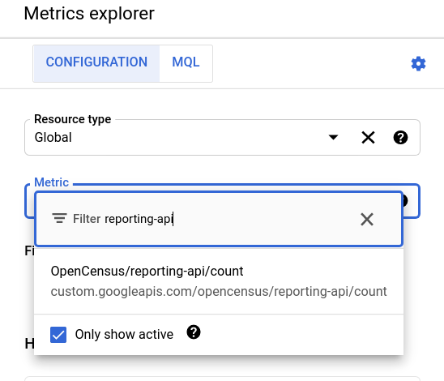
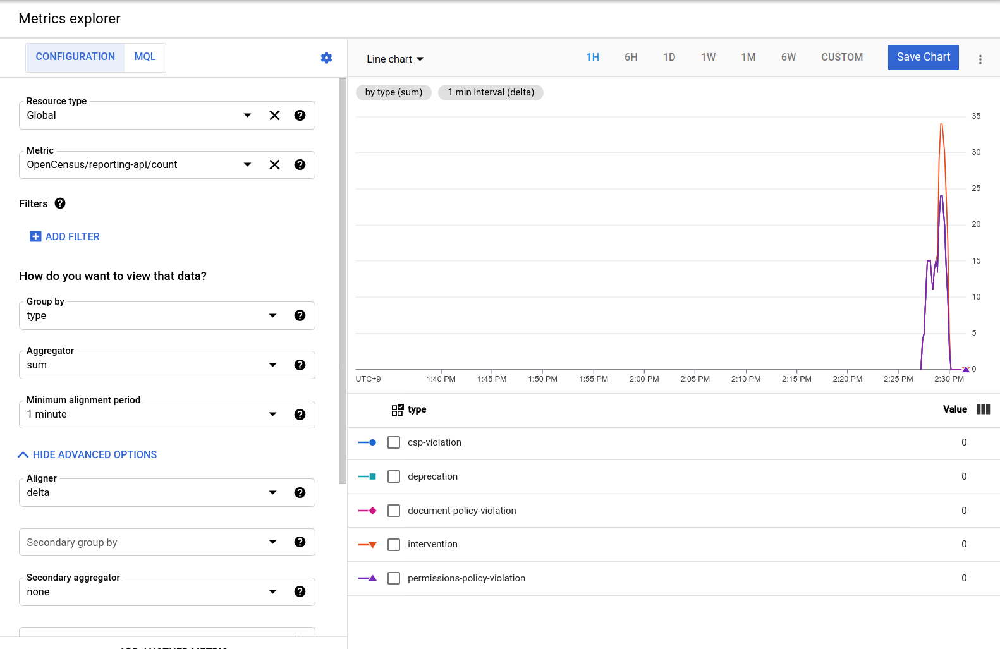

# Reporting API forwarder

This is an unoffical Google project to demonstrate the [Reporting API](https://www.w3.org/TR/reporting/)'s endpoint server.
This server works as a web server that receives all data from Reporting API and forwards them to [Google Cloud Monitoring](https://cloud.google.com/monitoring).

## How to try this sample
### Prepare report endpoint server

This repository contains two subdirectories:

* `forwarder`: the root of source code that contains Go web server
* `collector`: config file

To confirm the details of each subdirectories, please find and read `README` files in each directories.

After setting up Docker Compose (detailed in [README](./collector/README.md)), launch the Reporting API endpoint system with the following command:

```console
$ docker-compose up
```

### Remix glitch samples

After creating [Glitch](https://glitch.com) account, remix the following two projects.

1. https://glitch.com/edit/#!/reporting-api-demo
2. https://glitch.com/edit/#!/interevention-generator

`reporting-api-demo` is the report generator, and `intervention-generator` is the source to generate intervention error that is called via the iframe DOM in the `reporting-api-demo`.
For the name of remix projects, the recommendation is to add your own suffix to both like `reporting-api-demo-<suffix>`, such as `reporting-api-demo-yoshifumi` and `intervention-generator-yoshifumi`

Once you remixed the two project, you need to modify the value of endpoint URLs.

In `reporting-api-demo-<suffix>`, open `server.js`, find the following lines and fix the value.

```javascript
const REPORTING_ENDPOINT_BASE = "https://<the URL where you run the endpoint server>"
...(omit)...
const INTERVENTION_GENERATOR_URL = "https://intervention-generator-<suffix>.glitch.me/";
```

In `intervention-generator-<suffix>`, open `server.js`, find the following lines and fix the value.

```javascript
const REPORTING_ENDPOINT = "https://<the URL where you run the endpoint server>/default";
```

### Confirm data reception

If the endpoint system is working correctly, you will see the following outputs on your console:


```
collector_1  | 2021-09-05T05:08:02.622Z DEBUG   loggingexporter/logging_exporter.go:66  ResourceMetrics #0
collector_1  | Resource labels:
collector_1  |      -> service.name: STRING(unknown_service:server)
collector_1  |      -> telemetry.sdk.language: STRING(go)
collector_1  |      -> telemetry.sdk.name: STRING(opentelemetry)
collector_1  |      -> telemetry.sdk.version: STRING(1.0.0-RC3)
collector_1  | InstrumentationLibraryMetrics #0
collector_1  | InstrumentationLibrary reporting-api-forwarder 0.1.0.dev
collector_1  | Metric #0
collector_1  | Descriptor:
collector_1  |      -> Name: report.count
collector_1  |      -> Description: number of reports
collector_1  |      -> Unit: call
collector_1  |      -> DataType: Sum
collector_1  |      -> IsMonotonic: true
collector_1  |      -> AggregationTemporality: AGGREGATION_TEMPORALITY_CUMULATIVE
collector_1  | NumberDataPoints #0
collector_1  | Data point attributes:
collector_1  |      -> column-number: INT(24)
collector_1  |      -> dispotision: STRING(enforce)
collector_1  |      -> generated: INT(1630818474100)
collector_1  |      -> line-number: INT(14)
collector_1  |      -> message: STRING(Permissions policy violation: microphone is not allowed in this document.)
collector_1  |      -> policy-id: STRING(microphone)
collector_1  |      -> source-file: STRING(https://reporting-api-demo-otel.glitch.me/script.js)
collector_1  |      -> type: STRING(permissions-policy-violation)
collector_1  |      -> url: STRING(https://reporting-api-demo-otel.glitch.me/page)
collector_1  |      -> useragent: STRING(Mozilla/5.0 (X11; Linux x86_64) AppleWebKit/537.36 (KHTML, like Gecko) Chrome/95.0.4628.3 Safari/537.36)
collector_1  | StartTimestamp: 2021-09-05 04:49:42.432981665 +0000 UTC
collector_1  | Timestamp: 2021-09-05 05:08:02.440571589 +0000 UTC
collector_1  | Value: 1
collector_1  | NumberDataPoints #1
collector_1  | Data point attributes:
collector_1  |      -> column-number: INT(12)
...(omit)...
```

This is because the default configuration of OpenTelemetry Collector is set up with [loggingexporter](https://github.com/open-telemetry/opentelemetry-collector/tree/main/exporter/loggingexporter) as well as [googlecloudexporter](https://github.com/open-telemetry/opentelemetry-collector-contrib/tree/main/exporter/googlecloudexporter).

This means, your Reporting API endpoint system is working properly and it should be sending the corresponding report data to Google Cloud Monitoring.


### Confirm Google Cloud Monitoring

Open your Google Cloud Console and navigate yourself to Metrics Explorer in Google Cloud Monitoring. Then, try the following values in the forms:

* Resource Type: `global`
* Metric: filter `reporting-api/count` -> select `custom.googleapis.com/opencensus/reporting-api/count`
* Group by: `type`
* Aligner: `delta`




