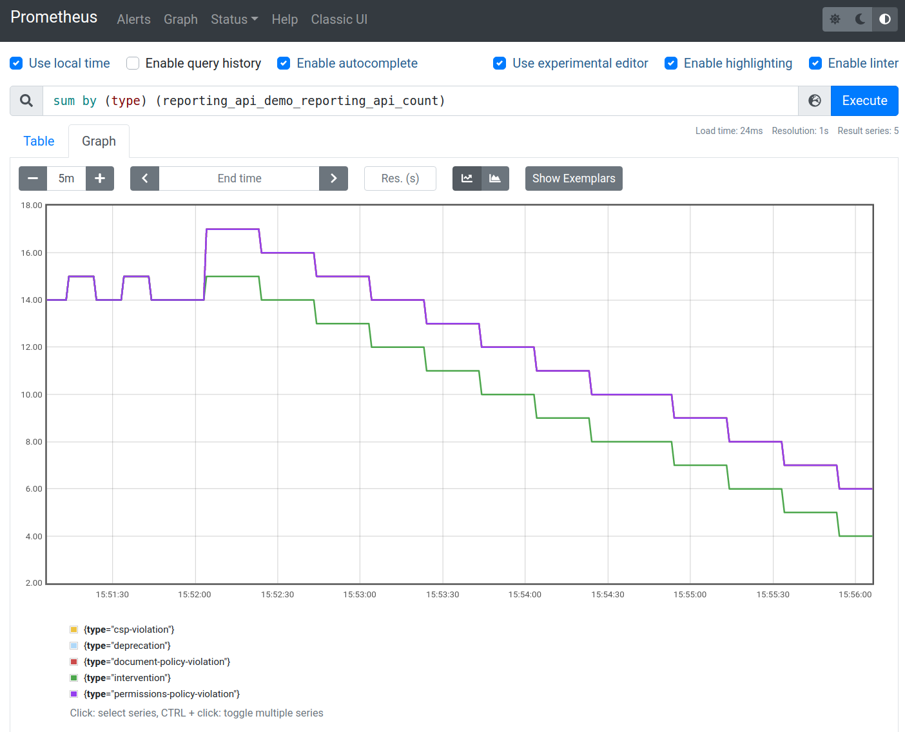

# Reporting API forwarder

This is an unoffical Google project to demonstrate the [Reporting API](https://www.w3.org/TR/reporting/)'s endpoint server.
This server works as a web server that receives all data from Reporting API and forwards them to monitoring tools such as [Google Cloud Monitoring](https://cloud.google.com/monitoring).
Also, for local testing purpose, you can try [Prometheus](https://prometheus.io/) with some additional configurations.


## Components

This repository contains the following subdirectories:

* `forwarder`: the main component that receives reports and forwards them to OpenTelemetry Collector
* `collector`: the config file for OpenTelemetry Collector
* `prometheus`: (optional) the config file for Prometheus
* `grafana`: (optional) the config file for Grafana

To confirm the details of each subdirectories, please find and read `README` files for detailed instructions.

The interaction of each components is described as below:


## How to try this sample

This repository comes with a couple of sets of configurations to try the forwarder. The options are:

1. With Cloud Monitoring
2. 2With Prometheus and Grafana
3. Running on Google Kubernetes Engine

Option 1 and 2 run a set of containers on the local environment and option 3 runs them on Google Cloud.

Option 1 and 3 require Google Cloud account with billing set up, and may end up some charges. If it is your first time to try Google Cloud, refer to [Google Cloud Free Program](https://cloud.google.com/free/docs/gcp-free-tier) which provides 300USD tree tier for 90 days.

### Prerequisites

* [Docker Engine](https://docs.docker.com/engine/install/)
  * If you run the forwarder in Docker or to run `docker compose`

* [Docker Compose](https://docs.docker.com/compose/install/)
  * For the cases "With Cloud Monitorig" and "with Prometheus"

* Google Cloud project and [`gcloud`](https://cloud.google.com/sdk/docs/install) command
  * For the case "With Cloud Monitoring" and "Running on Google Kubernetes Engine"

* [`kubectl`](https://kubernetes.io/docs/tasks/tools/#kubectl)
  * For the case "Running on Google Kubernetes Engine"

* [`skaffold`](https://skaffold.dev/docs/install/)
  * For the case "Running on Google Kubernetes Engine"

* [`terraform`](https://learn.hashicorp.com/tutorials/terraform/install-cli)
  * For the case "Running on Google Kubernetes Engine"

`kubectl` and `skaffold` are available via `gcloud components install` command. See [the document](https://cloud.google.com/sdk/docs/components) on how to install those command via `gcloud`.

### With Cloud Monitoring

#### Prepare Google Cloud project

In order to run this sample, you need to set up a Google Cloud project.

First, you need to create default credentials. Run the following commands for this demo.

```console
$ gcloud auth application-default login
$ chmod a+r ~/.config/gcloud/application_default_credentials.json
```
> **Note:** The instruction to change file permission of the credntial is just for this demonstration purpose, so after running this demo, please overwrite the permission as it was.
>
> ```console
> $ chmod go-r ~/.config/gcloud/application_default_credentials.json
> ```

Then you need a project where you send the reports to.

```console
$ gcloud projects create reporting-api-demo
```

Once the command is successfully done, enable "Cloud Monitoring API" in the project.

```console
$ gcloud services eanble monitoring
```

#### Prepare forwarder

After setting up Google Cloud project and credentials, you need to run the fowarder (reporting API endpoint).
Specify TLS certification files with the environment variables `CERT_FILE` and `KEY_FILE`. The default value is set to `cert/cert.pem` and `cert/key.pem`.

Then you need to add TLS certification files to `forwarder/cert` directory. Add cert file and key file there with the name `cert.pem` and `key.pem`.

After setting up [Docker Compose](https://docs.docker.com/compose/) (detailed in [README](./collector/README.md)), launch the Reporting API endpoint system with the following command:

```console
$ PROJECT_ID=$(gcloud config get-value project) docker-compose up
```

Then you will see the logs like the followings:

```console
$ docker-compose up
WARNING: Found orphan containers (reporting-api-forwarder_prometheus_1, reporting-api-forwarder_reporter_1) for this project. If you removed or renamed this service in your compose file, you can run this command with the --remove-orphans flag to clean it up.
Starting reporting-api-forwarder_collector_1 ... done
Starting reporting-api-forwarder_forwarder_1 ... done
Attaching to reporting-api-forwarder_forwarder_1, reporting-api-forwarder_collector_1
forwarder_1  | {"severity":"INFO","timestamp":"2021-09-28T07:36:23.080139909Z","message":"Starting Reporting API forwarder: version 0.1.0.dev"}
forwarder_1  | ⇨ https server started on [::]:30443
collector_1  | 2021-09-28T07:36:23.473Z info    service/collector.go:303        Starting otelcontribcol...      {"Version": "v0.34.0", "NumCPU": 12}
collector_1  | 2021-09-28T07:36:23.474Z info    service/collector.go:242        Loading configuration...
...(omit)...
collector_1  | 2021-09-28T07:36:23.480Z info    service/collector.go:218        Everything is ready. Begin running and processing data.
```

As you can confirm in `docker-compose.yaml`, this demo uses the following ports:

|Port in localhost|Service using the port|Port in services|Purpose|
|-----------------|----------------------|----------------|-------|
|30443|forwarder|30443|HTTPS server endpoint|
|8080|forwarder|8080|HTTP server endpoint|
|4317|collector|4317|OTLP gRPC endpoint|
|4318|collector|4318|OTLP HTTP endpoint|
|9990|collector|9990|Prometheus exporter endpoint|
|8888|collector|8888|Colletor's metrics exporting endpoint|
|9090|prometheus|9090|Prometheus UI's endpoint|

#### Remix glitch samples

After creating [Glitch](https://glitch.com) account, remix the following two projects.

1. https://glitch.com/edit/#!/reporting-api-demo
2. https://glitch.com/edit/#!/intervention-generator

`reporting-api-demo` is the report generator, and `intervention-generator` is the source to generate intervention error that is called via the iframe DOM in the `reporting-api-demo`.
For the name of remix projects, the recommendation is to add your own suffix to both like `reporting-api-demo-<suffix>`, such as `reporting-api-demo-yoshifumi` and `intervention-generator-yoshifumi`

Once you remixed the two project, you need to modify the value of endpoint URLs.

In `reporting-api-demo-<suffix>`, open `server.js`, find the following lines and fix the value.

```javascript
const REPORTING_ENDPOINT_BASE = "https://<the URL where you run the endpoint server>"
...(omit)...
const INTERVENTION_GENERATOR_URL = "https://intervention-generator-<suffix>.glitch.me/";
```

In `intervention-generator-<suffix>`, open `server.js`, find the following lines and fix the value.

```javascript
const REPORTING_ENDPOINT = "https://<the URL where you run the endpoint server>/default";
```

> **NOTE:** This demo requires `OPTION` HTTP method to work, so some handy solutions such as ngrok can't be an option. [This article](https://web.dev/how-to-use-local-https/) explains how to setup local environment for HTTPS connection from glitch to the forwarder.

#### Confirm data reception

If the endpoint system is working correctly, you will see the following outputs on your console:


```
collector_1  | 2021-09-05T05:08:02.622Z DEBUG   loggingexporter/logging_exporter.go:66  ResourceMetrics #0
collector_1  | Resource labels:
collector_1  |      -> service.name: STRING(unknown_service:server)
collector_1  |      -> telemetry.sdk.language: STRING(go)
collector_1  |      -> telemetry.sdk.name: STRING(opentelemetry)
collector_1  |      -> telemetry.sdk.version: STRING(1.0.0-RC3)
collector_1  | InstrumentationLibraryMetrics #0
collector_1  | InstrumentationLibrary reporting-api-forwarder 0.1.0.dev
collector_1  | Metric #0
collector_1  | Descriptor:
collector_1  |      -> Name: report.count
collector_1  |      -> Description: number of reports
collector_1  |      -> Unit: call
collector_1  |      -> DataType: Sum
collector_1  |      -> IsMonotonic: true
collector_1  |      -> AggregationTemporality: AGGREGATION_TEMPORALITY_CUMULATIVE
collector_1  | NumberDataPoints #0
collector_1  | Data point attributes:
collector_1  |      -> column-number: INT(24)
collector_1  |      -> dispotision: STRING(enforce)
collector_1  |      -> generated: INT(1630818474100)
collector_1  |      -> line-number: INT(14)
collector_1  |      -> message: STRING(Permissions policy violation: microphone is not allowed in this document.)
collector_1  |      -> policy-id: STRING(microphone)
collector_1  |      -> source-file: STRING(https://reporting-api-demo-otel.glitch.me/script.js)
collector_1  |      -> type: STRING(permissions-policy-violation)
collector_1  |      -> url: STRING(https://reporting-api-demo-otel.glitch.me/page)
collector_1  |      -> useragent: STRING(Mozilla/5.0 (X11; Linux x86_64) AppleWebKit/537.36 (KHTML, like Gecko) Chrome/95.0.4628.3 Safari/537.36)
collector_1  | StartTimestamp: 2021-09-05 04:49:42.432981665 +0000 UTC
collector_1  | Timestamp: 2021-09-05 05:08:02.440571589 +0000 UTC
collector_1  | Value: 1
collector_1  | NumberDataPoints #1
collector_1  | Data point attributes:
collector_1  |      -> column-number: INT(12)
...(omit)...
```

This is because the default configuration of OpenTelemetry Collector is set up with [loggingexporter](https://github.com/open-telemetry/opentelemetry-collector/tree/main/exporter/loggingexporter) as well as [googlecloudexporter](https://github.com/open-telemetry/opentelemetry-collector-contrib/tree/main/exporter/googlecloudexporter).

This means, your Reporting API endpoint system is working properly and it should be sending the corresponding report data to Google Cloud Monitoring.


#### Confirm Google Cloud Monitoring

Open your Google Cloud Console and navigate yourself to Metrics Explorer in Google Cloud Monitoring. Then, try the following values in the forms:

* Resource Type: `global`
* Metric: filter `reporting-api/count` -> select `custom.googleapis.com/opencensus/reporting-api/count`
* Group by: `type`
* Aligner: `delta`


### With Prometheus and Grafana

This sample also provides the configuration to play with [Prometheus](https://prometheus.io/) and [Grafana](https://grafana.com/)

You can run `docker-compose` with the configuration file for Prometheus and you will see the logs from Docker Compose.

```console
$ docker-compose -f docker-compose-prometheus.yaml up
```

This docker-compose uses the following ports:

|Port in localhost|Service using the port|Port in services|Purpose|
|-----------------|----------------------|----------------|-------|
|30443|forwarder|30443|HTTPS server endpoint|
|8080|forwarder|8080|HTTP server endpoint|
|4317|collector|4317|OTLP gRPC endpoint|
|4318|collector|4318|OTLP HTTP endpoint|
|9990|collector|9990|Prometheus exporter endpoint|
|8888|collector|8888|Colletor's metrics exporting endpoint|
|9090|prometheus|9090|Prometheus UI's endpoint|


If the configuration is working correctly and you are getting the reports from the browser, you can access [the query page (http://localhost:9090)](http://localhost:9090/graph?g0.expr=sum%20by%20(type)%20(reporting_api_demo_reporting_api_count)&g0.tab=0&g0.stacked=0&g0.show_exemplars=0&g0.range_input=5m) and you will see the line chart like below:



Also you can access to [the pre-defined dashboard of Grafana](http://localhost:3000/d/uhbXu_H7z/reporting-api?orgId=1).


### Running on Google Kubernetes Engine

This repository also contains the way to run the demo on [Google Kubernetes Engine (GKE)](https://cloud.google.com/kubernetes-engine) to share the demo in public with the team. Note that this is just a demo, so **do not use this demo as-is for production.**

> **NOTE:** This script creates a new Google Cloud project.
#### Prerequisites

First, to deploy this demo onto a GKE Cluster, you need to have [a billing account](https://cloud.google.com/billing/docs/how-to/manage-billing-account).

Also, you need to have the following commands in your environment.

* [`terraform`](https://learn.hashicorp.com/tutorials/terraform/install-cli)
* `gcloud`
* [Docker Engine](https://docs.docker.com/engine/install/)
* [`kubectl`](https://kubernetes.io/docs/reference/kubectl/overview/)
* [`skaffold`](https://skaffold.dev/)

Make sure to install these commands in advance. Also, the demo needs to have **a custom domain** (eg. `reporting.example.com`). You will need to add a DNS record for it later on.

#### Deploy a Kubernetes cluster to GKE

In order to deploy and run the demo on GKE and to make it accessible in HTTPS, you need some preparations in advance and to run some commands.

* Prepare a custom domain for the demo
* Run Terraform script
* Register a DNS record to the domain registerer

##### Prepare a custom domain

Because this demo uses [Google-managed SSL certificates](https://cloud.google.com/load-balancing/docs/ssl-certificates/google-managed-certs), you need to prepare a custom domain for the demo in advance.

The domain name can be anything that you own and you can edit a DNS record for it. Note the custom domain name (eg. `reporting-api.example.com`), which will be used to specify in the configuration file in the next step.

##### Run Terraform script

Change the current directory to `${PROJECT_ROOT}/gke/terraform` and dupulicate `terraform.tfvars.sample` as `terraform.tfvars`. Open `terraform.tfvars` and edit the variables there:

* `zone`: Google Cloud zone name. Find your most comfortable zone from [this page.](https://cloud.google.com/compute/docs/regions-zones)
* `custom_domain`: The custom domain name that you prepared in the previous step
* `billing_account`: The billing account you use for the demo.

Once the configuration is done, then you can run the following script in the same directory as `terraform.tfvars` and other `*.tf` files. First, initialize the terraform project with `terraform init` command.

```console
$ terraform init

Initializing the backend...

Initializing provider plugins...
...(omit)...

Terraform has been successfully initialized!

You may now begin working with Terraform. Try running "terraform plan" to see
any changes that are required for your infrastructure. All Terraform commands
should now work.

If you ever set or change modules or backend configuration for Terraform,
rerun this command to reinitialize your working directory. If you forget, other
commands will detect it and remind you to do so if necessary.
```

This commands installs all dependencies into your environment. Now you can run `terraform plan` command.

```console
$ terraform plan
```

Confirm that you don't see any errors with this command. (If you see any, please report the issue.) Then you finally run `terraform apply` command. Note that Terraform utilizes the application default credentials, so make sure that the credenatial has enough access such as `roles/owner`.

```console
$ terraform apply -auto-approve
...(omit)...
local_file.ingress_yaml: Creating...
local_file.ingress_yaml: Creation complete after 0s [id=37e6389892e235ae53b3910082c3c047ec609252]

Apply complete! Resources: 2 added, 0 changed, 0 destroyed.

Outputs:

container_registry_path = "us-central1-docker.pkg.dev/<project_id>/reporting-api-registry"
reporting_api_endpoint_ip_address = "34.96.121.153"
```

You will see a bunch of logs on the screen. The process may take 10 minutes or more, so be patient until it successfully finish applying the changes to the project. As a result, you will see the section at the bottom starting with "Outputs:". See the IP address at the bottom and register the address in the DNS record setting of your custom domain. For example, in the case of [Google Domains](https://domains.google/), you can configure the DNS record as follows:


For testing purpose, it's better to set TTL shorter such as 60s.

#### Run `skaffold`

Now you are ready to run `skaffold` to deploy the Kubernetes cluster to GKE.

```console
$ cd ${PROJECT_ROOT}/gke
$ skaffold run --tail

Generating tags...
 - forwarder -> gcr.io/<project_id>/reporting-api/forwarder:7ba4376-dirty
 - collector -> gcr.io/<project_id>/reporting-api/collector:7ba4376-dirty
Checking cache...
 - forwarder: Not found. Building
 - collector: Not found. Building
Starting build...
Building [forwarder]...
Sending build context to Docker daemon  17.32MB
Step 1/11 : FROM golang:1.17-bullseye as builder
 ---> 9f8b89ee4475
Step 2/11 : WORKDIR /src

...(omit)...

 - deployment.apps/collector created
 - service/collector created
Waiting for deployments to stabilize...
 - deployment/collector: creating container collector
    - pod/collector-5cbfb8dfd4-bbjgc: creating container collector
 - deployment/forwarder: creating container forwarder
    - pod/forwarder-b866cdf54-gh6np: creating container forwarder
 - deployment/forwarder is ready. [1/2 deployment(s) still pending]
 - deployment/collector is ready.
Deployments stabilized in 1 minute 1.717 second
You can also run [skaffold run --tail] to get the logs
```

One thing to note is that it takes 15-20 minutes for the certificate manager to take effect, so you may not able to access to your custom domain (eg. `https://reporting.example.com/`) via HTTPS until it takes effect.
You can confirm the status of the certificate provisioning by `kubectl describe managedcertificate` command.

As you see in `${PROJECT_ROOT}/gke/manifests/certificate.yaml`, your certificate is managed with the name `reporting-api-cert`.

```console
$ kubectl describe managedcertificate reporting-api-cert
Name:         reporting-api-cert
Namespace:    default
Labels:       app.kubernetes.io/managed-by=skaffold
              skaffold.dev/run-id=85a43ea1-345c-43d3-9676-9ddf398ccf81
Annotations:  <none>
API Version:  networking.gke.io/v1

...(omit)...

Spec:
  Domains:
    reporting.example.com
Status:
  Certificate Name:    mcrt-2476e85b-385e-4a93-b41c-77c668cd47ce
  Certificate Status:  Active
  Domain Status:
    Domain:     reporting.example.com
    Status:     Active
  Expire Time:  2022-01-12T15:50:28.000-08:00
Events:
  Type    Reason  Age   From                            Message
  ----    ------  ----  ----                            -------
  Normal  Create  17m   managed-certificate-controller  Create SslCertificate mcrt-2476e85b-385e-4a93-b41c-77c668cd47ce
```

Confirm the value of "Status > Domain Status > Status" got "Active". (If it is any other values such as "Provisioning", the certificate is not ready yet.)
Then, you should be able to access `https://reporting.example.com/healthz` and get the result `"OK"` with the status code 200.

```console
$ curl -vvvv "https://reporting.example.com/healthz"
*   Trying 35.244.202.19:443...
* Connected to reporting.example.com (35.244.212.19) port 443 (#0)
* ALPN, offering h2
... (omit) ...
* Connection state changed (MAX_CONCURRENT_STREAMS == 100)!
< HTTP/2 200
< content-type: text/plain; charset=UTF-8
< vary: Origin
< date: Fri, 15 Oct 2021 11:53:08 GMT
< content-length: 2
< via: 1.1 google
< alt-svc: clear
<
* Connection #0 to host reporting.example.com left intact
OK%
```

Now you can specify `https://<your custom domain>` to glitch Reproting API demo client and try how it works in Cloud Monitoring UI as described in "With Cloud Monitoring" section.


##### Clean up

After confirming the behavior of Reporting API and Cloud Monitoring, you should shutdown the deme project so that you don't get charged unexpectedly.

First shutdown the application running on the GKE cluster.

```console
$ skaffold delete
```

Then you can shutdown the project with Terraform gracefully.

```console
$ terraform destroy
...(omit)...

google_project_service.artifact_registry: Still destroying... [id=<project_id>/artifactregistry.googleapis.com, 10s elapsed]
google_project_service.artifact_registry: Destruction complete after 11s
google_project.demo_project: Destroying... [id=projects/<project_id>]
google_project.demo_project: Destruction complete after 3s
random_string.project_suffix: Destroying... [id=s2la0q]
random_string.project_suffix: Destruction complete after 0s

Destroy complete! Resources: 20 destroyed.
```

Finally, confirm that your demo project is not listed on [Google Cloud Console UI](https://console.cloud.google.com/billing/projects) as well.

### Standalone

If you already uses OpenTelemetry Collector and have the monitoring backend, you can run `forwarder` alone.

```console
$ cd forwarder
$ go build -o forwarder
$ COLLECTOR_ADDR=example.com:4317 ./forwarder
```

Make sure to put your certificate files (`cert.pem` and `key.pem`) in the `cert` file relative to the executor.
Otherwise, specify the path to both files with the environment variables `CERT_FILE` and `KEY_FILE`.


## Troubleshooting

### `PermissionDenied` error for Cloud Monitoring

If you see `code = PermissionDenied` error on sending metrics to Google Cloud Monitoring, like:

```console
collector_1   | 2021-09-29T04:03:11.441Z        info    exporterhelper/queued_retry.go:231      Exporting failed. Will retry the request after interval.        {"kind": "exporter", "name": "googlecloud", "error": "rpc error: code = PermissionDenied desc = Permission monitoring.metricDescriptors.create denied (or the resource may not exist).", "interval": "16.812982588s"}
```

You can check the following configurations:

* If the application default credentials is the one for the account you want to use
* If the Cloud Monitoring API is enabled in the project

### `forwarder` container image doesn't refresh

If you replace the certification files and observe no changes with `forwarder` container image, `docker-compose` should be running the cache. Try the following command and see how it goes.

```console
$ docker-compose build --no-cache
```

### Permission error of config files

If you face the following permission errors of reading config files, just add read access of those files to others: `chmod a+r path/to/config.file`.

```console
collector_1   | 2021-09-29T06:04:41.745Z        info    service/collector.go:242        Loading configuration...
collector_1   | Error: cannot load configuration's parser: error loading config file "/etc/otel/config.yaml": unable to read the file /etc/otel/config.yaml: open /etc/otel/config.yaml: permission denied
```
